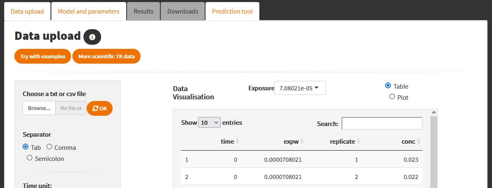

# Summary

`rbioacc` is an `R`-package dedicated to the analysis of experimental data collected from bioaccumulation tests. It provides ready-to-use functions to visualise a data set and to estimate bioaccumulation metrics to be further used in support of environmental risk assessment, in full compliance with regulatory requirements. Such metrics are classically requested by standardised regulatory guidelines on which national agencies base their evaluation of applications for regulatory approval of chemical substances.

Package `rbioacc` can be used to get estimates of toxicokinetic (TK) parameters (uptake and elimination rates) and bioaccumulation metrics (e.g., BCF, BSAF, BMF) by fitting a one-compartment TK model on accumulation-depuration test data by Bayesian inference. The estimates of bioaccumulation metrics as well as the parameters and the predictions of the internal concentrations are given with the quantification of their uncertainty.

This paper illustrates some classical uses of `rbioacc` with internal concentrations collected over time for organism possibly exposed at several concentrations, analysed with a generic TK one-compartment model. These examples can be followed step-by-step to analyse any new data set, only if the data set format is respected.

# Statement of need

`rbioacc` is an `R`-package [@rbioacc2021] compatible with version 4.1.0 and later of R and with all standard operation systems (macOS, Linux, Windows). Regarding the particular case of TK models, package `rbioacc` was compared with published results considering other TK implementations under different software platforms. Giving very similar results than the other implementations, package `rbioacc` was thus confirmed as fit-for-purpose in fitting TK models on bioaccumulation test data [@Ratier2019; @Ratier2021; @Charles2021; @Charles2021b]. All functions in package `rbioacc` can be used without a deep knowledge of their underlying probabilistic model or inference methods. Indeed, they were designed to behave easily as possible, without requiring the user to provide values for some parameters. Nevertheless, models implemented in `rbioacc` can also be used as a first step to create new models for more specific situations. Note that package `rbioacc` benefits from a web interface, MOSAIC\textsubscript{bioacc}, from which the same analyses can be reproduced directly on-line without having to implement it in R programming. MOSAIC\textsubscript{bioacc} is freely available from the MOSAIC platform at <https://mosaic.univ-lyon1.fr> [@Charles2021] or directly from [https://mosaic.univ-lyon1.fr/bioacc](https://mosaic.univ-lyon1.fr/bioacc/) [@Ratier2021].

# Availability

Package `rbioacc` is available as an `R`-package (with `R >= 4.1.0`) ; and thus can be directly downloaded from CRAN at <https://CRAN.R-project.org/package=rbioacc>. Package dependencies and system requirements are documented to help users with their installation issues. Besides, this package is available on a GitHub repository (useful for the users to post issues): <https://github.com/cran/rbioacc>.

# Main features

The main functions in package `rbioacc` are `modelData()` and `modelData_ode()` to format and visualise raw data as well as to build the corresponding TK model. Function `fitTK()` allows to fit a one-compartment TK model on data in order to estimate the bioaccumulation metrics and the kinetic parameters. Fitting outputs can be either displayed with `plot()` or summarized with `quantile_table()`. For the calculation of bioaccumulation metrics, both functions `bioacc_metric()` and `plot()` may be run providing the plot of the posterior probability distribution bioaccumulation metric density. Function `quantile()` gives a summary of this distribution. To obtain the time at which 95% of the chemical substance is eliminated, function `t95()` can be used. Underlying equations can be obtained by function `equations()`, after the fitting process. Some functions are available to check the goodness-of-fit criteria, namely `ppc()`, `plot_PriorPost()`, `corrMatrix()`, `corrPlot()`, `psrf()`, `waic()`, `mcmcTraces()`. Finally, functions `predict()` and `predict_manual()` allow to perform predictions with or without previous observed data.

Package `rbioacc` currently handles constant or time-variable exposure concentrations data. It allows the user to follow a generic workflow:

1. upload and format a data set;
2. plot the data set;
3. fit a TK model on the data;
4. get model equations, parameter estimates and bioaccumulation metrics (BCF, BSAF and/or BMF);
5. check goodness-of-fit criteria (e.g., the Posterior Predictive Check (PPC) percentage and the Widely Applicable Information Criterion (WAIC); 
6. get model predictions and their uncertainty superimposed to the data;
7. perform validation of the model on external data.

Those steps are described in details in the `Tutorial` available at <https://doi.org/10.5281/zenodo.5092316>, including the description on how to use all `rbioacc` features. More information on the model and the inference process used in this package are given in a document called "User Guide" available at <http://lbbe-shiny.univ-lyon1.fr/mosaic-bioacc/data/user_guide.pdf> and in the companion paper of the web interface [@Ratier2021]. Please refer to this documentation for further introduction to the use of package `rbioacc`.

# Minimal Working Examples
## Installation
### Stan

Package `rbioacc` is linked to Stan ([https://mc-stan.org/](https://mc-stan.org/users/interfaces/)), a Bayesian sampler used to perform inference with all implemented models. In order to use Stan on R, it requires to install `R`-packages `rstan` [@rstan] and `rstantools` [@rstantools].

### Loading `rbioacc` and its dependencies

In order to use package `rbioacc`, you need to install it with all its dependencies on other `R`-packages: `ggplot2, Rcpp (>= 0.12.0), RcppParallel (>= 5.0.1), rstan (>= 2.18.1), rstantools (>= 2.1.1), testthat, ggmcmc, GGally, loo, stringr, zoo (>= 1.8-9), BH (>= 1.66.0), RcppEigen (>= 0.3.3.3.0), StanHeaders (>= 2.18.0)`, `knitr`, and `rmarkdown`. For this purpose, you can use the two classical `R` commands:

```
### install package `rbioacc`, if needed
if(is.element('rbioacc', installed.packages()[, 1]) == FALSE){
  install.packages('rbioacc')
}
### load package `rbioacc` 
library(rbioacc)
```
### C++

Package `rbioacc` is also linked to C++. C++ is used for speeding up calculations and for running simulations leading to predictions. In R, you should not have issues with C++ requirements since it is very well integrated.

## Toxicokinetic analysis

To illustrate the use of package `rbioacc`, we will use two standard bioaccumulation data sets available in the package. The first example is data collected from a laboratory bioaccumulation test on fish *Oncorhynchus promelas* exposed to three different concentrations of a highly hydrophobic compound in spiked water during 49 days. There was one replicate per concentration. The duration of the depuration phase was 97 days. The internal concentration was monitored at several time points [@Crookes2011]. The second example concerns species *Chironomus tentans*, a freshwater invertebrate, exposed to benzo-(a)-pyrene in spiked sediment during three days. Only one exposure concentration was tested with two replicates. The duration of the depuration phase was 3 days. The internal concentrations for both parent compound and its metabolite were monitored at several time points [@Schuler2003].

Environmental Risk Assessment (ERA) is based on OECD test guidelines (\textit{e.g.}, test n°305 [@OECD2012] or 315 [@OECD2008]) specifying the workflow to follow in order to obtain the bioaccumulation metrics. The bioaccumulation metrics are key decision criteria to define the capacity of a chemical substance to be bioaccumulated within organisms. This workflow can also be performed on-line with the MOSAIC web platform, especially the MOSAIC\textsubscript{bioacc} module (<https://mosaic.univ-lyon1.fr/bioacc>). In order to be in full compliance with such guidelines, the *modus operandi* with package `rbioacc` to be followed step-by-step is given below.

### Calibration step

For the first example, three exposure concentrations were tested; thus it is required to select one of these exposure concentrations before performing an analysis.

#### Data and inference process

```
### load package `rbioacc`
library(rbioacc)

# Example 1 ####

### load a data set
data("Oncorhynchus_two")
### create an rbioacc object for data analysis with the chosen exposure concentration
data <- Oncorhynchus_two[Oncorhynchus_two$expw == 0.00440,]
### build the TK model (automatically chosen) according to data
modeldata <- modelData(data, time_accumulation = 49)
# You must specify here the time at which the accumulation phase ends
### fit the TK model
m1 <- fitTK(modeldata)
```

```
# Example 2 ####

### load a data set
data("Chironomus_benzoapyrene")
### create an rbioacc object for data analysis
Chironomus_benzoapyrene <- Chironomus_benzoapyrene[Chironomus_benzoapyrene$exps == 0.0136,] 
### build the TK model (automatically chosen) according to data
modeldata2 <- modelData(Chironomus_benzoapyrene, time_accumulation = 3)
# You must specify here the time at which the accumulation phase ends
### fit the TK model
m2 <- fitTK(modeldata2, iter = 10000)
```

#### Results

The major results provided by package `rbioacc` are the fitted predictions of the internal concentrations superimposed to observed data versus time with function `plot()`. The posterior probability distribution of the bioaccumulation metric(s), whatever the exposure route(s) and the elimination process(es) is (are) given by function `bioacc_metric()`. For both examples, this function is used with the default option providing the kinetic bioaccumulation metric. The steady-state bioaccumulation metric can also be asked if the data seem having reached the steady-state at the end of the accumulation phase.

It is also possible to obtain a summary of the TK parameter distributions with function `quantile_table()`. In addition, the package provides the equations of the underlying model that has been built according to input data with function `equations()`. 

```
# Example 1 ####

### plot the fitting results
plot(m1)

### get the bioaccumulation metrics (here BCF, water)
BCFk_all <- bioacc_metric(m1,"k") # for kinetic bioaccumulation metrics
### get the summary of the kinetic bioaccumulation metric(s) distribution(s)
for(i in 1:ncol(BCFk_all)){
BCFk <- quantile(BCFk_all[, i], c(0.5, 0.025, 0.975))  
}
# Here the data have not reached a steady-state at the end of the accumulation phase
# BCFss is not recommended

### Plot bioaccumulation metrics probability distribution
plot(BCFk_all)

### get the kinetic parameter estimates
quantile_table(m1)

### get the time at which 95% of the chemical substance is eliminated
t95(m1)

### get the equations of the TK model built accordingly to the data
equations(m1, Oncorhynchus_two)
```

```
# Example 2 ####

### plot the fitting result
plot(m2)

### get the bioaccumulation metrics (here BSAF, sediment)
BSAFk_all <- bioacc_metric(m2, "k") # for kinetic bioaccumulation metrics
BSAFss_all <- bioacc_metric(m2, "ss") # for steady-state bioaccumulation metrics
### get the summary of the kinetic bioaccumulation metric(s) distribution(s)
for(i in 1:ncol(BSAFk_all)){
BSAFk <- quantile(BSAFk_all[, i], c(0.5, 0.025, 0.975))  
}
for(i in 1:ncol(BSAFss_all)){
BSAFss <- quantile(BSAFss_all[, i], c(0.5, 0.025, 0.975)) 
} 
# Display all
BSAF <- t(cbind(BSAFk, BSAFss))
BSAF
### Plot the bioaccumulation metrics probability distribution
plot(BSAFk_all)
plot(BSAFss_all)

### get the kinetic parameter estimates
quantile_table(m2)

### get the time at which 95% of the chemical substance is eliminated
t95(m2)

### get the equations of the TK model built accordingly to the data
equations(m2, Chironomus_benzoapyrene)
```

Figure \ref{fig:fig1} below shows the fitted predictions of internal concentrations with observed data for example 1, while Figure \ref{fig:fig2} represents the fitted predictions for example 2.

{width="50%"}

{width="50%"}


#### Goodness-of-fit (GOF) criteria

Once the predictions of the internal concentrations are visually checked (Figures \ref{fig:fig1} and \ref{fig:fig2}), several goodness-of-fit criteria required to be checked. For example, the PPC plot allows to compare each observed value to its prediction from the fitted model at the corresponding concentration and associated with the 95% credible interval. If the fit is correct, it is expected to have 95% of the observed values inside the credible intervals. With `rbioacc`, the PPC can be obtained with function `ppc()` as illustrated in \autoref{fig:fig3}. Other GOF can be checked, such as the comparison of prior and posterior distributions with function `plot_PriorPost()`, the correlation matrix of the model parameters (with `corrMatrix()` and `corrPlot()`), the potential scale reduction factor (PSRF) for each parameter with function `psrf()`, the traces of the MCMC for each parameter with `mcmcTraces()`, and the Widely Applicable Information Criterion (WAIC) with function `waic()`.

```
# Example 1 ####
### get the PPC 
ppc(m1)
ppc(m1)$labels$subtitle # to get the percentage
### get the plot of prior and posterior distributions for each parameter
plot_PriorPost(m1)
### get the correlations between parameters
corrMatrix(m1)
corrPlot(m1)
### get the PSRF value for each parameter
psrf(m1)
### get the traces of MCMC chains
mcmcTraces(m1)
### get the WAIC
waic(m1)
```

```
# Example 2 ####
### get the PPC 
ppc(m2)
ppc(m2)$labels$subtitle # to get the percentage
### get the plot of prior and posterior distributions for each parameter
plot_PriorPost(m2)
### get the correlations between parameters
corrMatrix(m2)
corrPlot(m2)
### get the PSRF value for each parameter
psrf(m2)
### get the traces of MCMC chains
mcmcTraces(m2)
### get the WAIC
waic(m2)
```

{width="100%"}

### Validation step

Validation consists in predicting the internal concentration over time for which observations have also been collected but not been used to get parameter estimates. Predictions are then compared to observations and their adequacy is checked according to several validation criteria, in particular those defined by EFSA (European Food Safety Agency) [@EFSA2018]. Then further simulations can be used to predict what could happen under other exposure concentrations, thus guiding complementary experiments in a more efficient way.\

Let's take as example, a data set where \textit{Spirostomum} was exposed to the pharmaceutical product fluoxetine at 0.025 $\mu g.mL^{-1}$ under spiked water during six days. These data were used for the calibration step [@NaleczJawecki2020], providing parameter estimates. Once calibrated, this model was used to predict what may happen at 0.1 $\mu g.mL^{-1}$ exposure concentration for which data were also available. Then for the validation process, the Figure \ref{fig:fig4} shows the prediction against the experimental data.


```
# Calibration ####
# create the dataframe with data collected at 0.025 µg/mL
df_0.025 <- structure(list(
  time <- c(0, 0.083, 1, 2, 6, 7, 8, 12, 0, 0.083, 1, 2, 6, 7, 8, 12), 
  conc <- c(0, 1.2, 2.94, 3.57, 4.65, 1.52, 1.73, 1.89, 0, 4.7, 11.04,
    6.65, 10.91, 3.37, 3.13, 2.88), 
  replicate <- c(1, 1, 1, 1, 1, 1, 1, 1, 2, 2, 2, 2, 2, 2, 2, 2), 
  expw <- c(0.025, 0.025, 0.025, 0.025, 0.025, 0.025, 0.025, 0.025, 0.025, 0.025,
    0.025, 0.025, 0.025, 0.025, 0.025, 0.025)), 
  row.names = c(NA, -16L), class = c("tbl_df", "tbl", "data.frame"))

data <- df_0.025
### build the TK model according to data
modeldata <- modelData(data, time_accumulation = 6) # indicate the time at the 
                                                    # end of exposure
### fit the TK model
m3 <- fitTK(modeldata)

# Validation ####
# create the dataframe with data collected at 0.1 µg/mL
df_0.1 <- structure(list(
  time <- c(0, 0.083, 1, 2, 6, 7, 8, 12, 0, 0.083, 1, 2, 6, 7, 8, 12), 
  conc <- c(0, 2.95, 10.02, 15.45, 12.82, 5.75, 5.08, 3.15, 0, 14.66, 29.54, 
    30.51, 28.65, 15.46, 11.77, 9.07), 
  replicate <- c(1, 1, 1, 1, 1, 1, 1, 1, 2, 2, 2, 2, 2, 2, 2, 2), 
  expw <- c(0.1, 0.1, 0.1, 0.1, 0.1, 0.1, 0.1, 0.1, 0.1, 0.1, 0.1, 0.1, 0.1,
    0.1, 0.1, 0.1)), 
  row.names = c(NA, -16L), class = c("tbl_df", "tbl", "data.frame"))

library(dplyr) # load the dplyr package to create predictions dataframe
# format data for predictions
data_4pred <- data.frame(unique(df_0.1 %>%
						 select(time, expw)))
# perform predictions
predict_m3 <- predict(m3, data_4pred)
# plot predictions
p <- plot(predict_m3)
p

# format data for validation
data_4val <- data.frame(unique(df_0.1 %>% 
						select(time, conc)))
# plot data against predictions
validation <- p + geom_point(data = data_4val, aes(x = time, y = conc))
validation
```

{width="50%"}

### Prediction step

If the validation step provides acceptable outputs, then the prediction step can be performed for further simulations under untested exposure concentrations or for a different accumulation time. In this perspective, both functions `predict()` or `predict_manual()` can be used, for example based on the example above with an exposure at 0.05 $\mu g.mL^{-1}$ (Figure \ref{fig:fig5}). Such prediction are done by propagating the uncertainty got on parameter estimates in the calibration step.

Another possibility is that only mean or median value for each parameter is available, for example as given in the scientific literature or from previous experiments in the laboratory, without the associated raw TK data. In such a case, neither calibration nor validation can be done in order to plan a new experiment according to the parameter values retrieved earlier. Thus, function `predict_manual()` can be used, as illustrated in Figure \ref{fig:fig6} with only the median values of parameters from Example 1 [@Crookes2011]. 

```
# With function predict()
# prepare data for prediction at exposure 0.05 µg/mL
# The total duration of the experiment is 15 days
data_4pred2 <- data.frame(time = 1:15, expw = 0.05)
plot(predict(m3, data_4pred2))


# With function predict_manual()
# Extract posterior table for each parameter
parfit_MGSG <- rstan::extract(m3[["stanfit"]])
mcmc_m3 <- data.frame(
  kee = parfit_MGSG$ke[, 1],
  kuw = parfit_MGSG$ku[, 1],
  sigmaConc = parfit_MGSG$sigmaCGpred[, 1]
)

data_4pred2 <- data.frame(time = 1:15, expw = 0.05)
plot(predict_manual(mcmc_m3, data_4pred2))
```


{width="50%"}

## Interpolation of exposure profile

Using linear interpolation of the exposure profile, we can plot the result of 
an inference process, a calibration, a validation or a prediction over a finer time
scale. The option is `time_interp` in function `plot()` for `fitTK` or `predictTK`
objects.

For instance in the model `m1`, the time step has 21 time points from 0 to 147.
For an interpolation at every unit of time step, we can provide the following code:

```
# m1 is a fitTK object so:
plot(m1, time_interp = seq(0,147,1))

```

The underlying prediction function is named `predict_stan` since it re-use the 
stan sampler to make the prediction. It can be accessed with:

```
# prediction step
predict_m3_stan <- predict_stan(m3, data_4pred, time_interp = seq(0,12,0.01), 
  mcmc_size = 2000, chains = 4)
# plot of the prediction
plot(predict_m3_stan)
```


```
# prepare data for prediction at exposure 0.01 µg/mL 
# The total duration of the experiment is 75 days
data_4pred <- data.frame(time = 1:75, expw = 0.01)
# perform predictions from a previous fit (distributed parameters)
predict_m1 <- predict(m1, data_4pred)
# perform predictions from median or mean parameter values (without uncertainty)
predict_m1_manual <- predict_manual(param = data.frame( # from median parameters
    kee = 0.03834562,
    kuw = 10.56466351
  ), data_4pred, time_accumulation = 49)
### plot predictions
plot(predict_m1) 
plot(predict_m1_manual)
```

![Example of the prediction step for fish *Oncorhynchus promelas* exposed to a very hydrophobic substance for 49 days. Orange curve is the predicted median of the internal concentration with the TK parameters provided by the authors [@Crookes2011] at an exposure concentration of 0.01 $\mu g.mL^{-1}$ (which can be changed by the user according to the desired experimental design).\label{fig:fig6}](pred_manual.png){width="50%"}

### Bioaccumulation under any time-variable exposure profile

Finally, it may be useful to predict the internal concentration under any exposure profile (time-variable or not), to better mimic an environmental exposure concentration, most often fluctuating than constant (e.g., when collecting field data). It first requires to load two types of data instead of one type for constant exposure: one data file with the time-variable exposure concentrations (at least two columns, `time` and `Cwater`) and another one for the internal concentrations (at least two columns, `time` and `Cinternal`). Secondly, it requires to call function `modelData_ode()` which will manage the ordinary differential equations for the time-variable exposure profile. Then the other functions can be used as previously illustrated in order to obtain all the results and the GOF criteria. The below code gives an example with a data set on *Sialis lutaria* exposed to a time-variable exposure profile of chlorpyrifos spiked water for two days [@Rubach2020].

```
data("Exposure_Sialis_lutaria")
data("Internal_Sialis_lutaria")
Exposure_Sialis_lutaria$value <- Exposure_Sialis_lutaria$Cwater
Internal_Sialis_lutaria$value <- Internal_Sialis_lutaria$Cinternal

modeldata_SL <- modelData_ode(Exposure_Sialis_lutaria, Internal_Sialis_lutaria, 
time_accumulation = 2.170)
fit_SL <- fitTK(modeldata_SL, iter = 100)
quantile_table(fit_SL)
```

# MOSAIC$\mathrm{_{bioacc}}$: a web application using `rbioacc`
## Brief presentation
In 2020, the MOSAIC$\mathrm{_{bioacc}}$ web application has been designed to allow for an easier toxicokinetics modelling of complex situations in the field of ecotoxicology [@Ratier2021]. MOSAIC$\mathrm{_{bioacc}}$ exploits a one-compartment model, meaning that the organism is considered as a whole. It explores a more complex TK part than what is used nowadays, that is multiple exposure routes are considered (up to four, among water, sediment, pore water and food) as well as biotransformation of the chemical in several metabolites and growth of organisms. MOSAIC$\mathrm{_{bioacc}}$ strives to offer an easy access to TK modelling, allowing the user to work with complex situations. It also provides several criteria for the user to easily assess the quality of the obtained fit. MOSAIC$\mathrm{_{bioacc}}$ is a tool thought for the regulatory domain, but also for research, as it provides a database of accumulation-depuration data fully referenced and associated with their fitting results and reports from MOSAIC$\mathrm{_{bioacc}}$ [@Ratier2021b]. MOSAIC$\mathrm{_{bioacc}}$ was developed using `R`-package `shiny` [@Shiny], thus providing an interactive interface to package `rbioacc`.

## Last updates
The present section showcases the last updates of MOSAIC$\mathrm{_{bioacc}}$ since the last papers [@Ratier2021; @Charles2021]. MOSAIC$\mathrm{_{bioacc}}$ shifted from an all embarked web application to being a user interface of the newly developed `R`-package `rbioacc`, that allows all users to bring MOSAIC$\mathrm{_{bioacc}}$ and its self-explanatory functions to their own device for an easy integration of its methodology to every workflow. Furthermore, new features were added: a prediction and a validation tools were added to the web application thanks to the functions implemented in `rbioacc`. 

### Aesthetic 

Whereas the previous version of MOSAIC$\mathrm{_{bioacc}}$ was based on a scroll of only one page, the new version works with several tabs unlocked once the user performed the actions needed in the previous tab, except for the prediction and validations tabs that are always available. Globally, the same visual elements were kept, but they got reorganised in a tabs structure with 5 different levels (Figure \ref{fig:figvisual}): \texttt{Data upload, Model and parameters, Results, Downloads, Prediction tool}. The results of the fitting process were also compacted in a tab and column structure to better suit the new no-scroll policy. This tremendously reduced the length of the section, as it can be visualized in Figure \ref{fig:gainline}. This revamp in a tab based interface, as well as other minor changes, were partly decided upon by analysing the behavior of the potential users of MOSAIC$\mathrm{_{bioacc}}$. 

{width="100%"}

{width="50%"}

### Architecture

The old version of MOSAIC$\mathrm{_{bioacc}}$ suffered from a mix of classical R coding and reactive R coding, the biggest obstacle being the use of global variables. These are generally not meant to be used in a reactive context, but can be forced as they can be useful in very punctual cases. Using them allowed for a more classical way of coding, but it generated a series of scope related bugs, notably for the downloads, that needed to be fixed with lengthy patch ups. Furthermore, using global variables promotes excessive code
reevaluation, making the application less effective.
Due to the long, iterative development process, other issues appeared such as code duplication, repetitive operations on variables, creation of unused variables and non explicit,
temporary variable names that ended up being kept.
All in all, the 'server' file (server.R, required in Shiny development) of the old version was approximately 4.5k lines long. 
For all these reasons, the file was entirely rewritten, which allows an easier code to maintain, to understand and to upgrade, by sectioning the code in multiple files, by introducing documentation with \texttt{roxygen} [@roxygen2] and more extensive comments through the code; and by strictly managing variable dependencies in an explicit way.
With both the refactoring of the code and the integration of package `rbioacc`, the server file became approximately 1k lines long, and 1.5k lines long by taking into account the other files containing code used by the server file.
The major benefit to this restructuring was to include package `rbioacc` in the downloadable R code from the application, gaining clarity and lines long, easier for a user to reuse the R code. 

### New features
A prediction and a validation tools were added to MOSAIC$\mathrm{_{bioacc}}$. The prediction tool allows the user to propagate the parameter values of a previous fit and their uncertainties to perform a simulation for a different exposure profile. The users can also use this tool on its own, with their own parameter values. The validation tool takes things a step further by allowing the visual comparison of a predicted accumulation-depuration curve to newly observed validation data.

# EFSA workflow with `rbioacc` or MOSAIC$\mathrm{_{bioacc}}$
The environmental risk assessment workflow proposed by the EFSA consists of three steps: the calibration, the validation and the prediction. MOSAIC$\mathrm{_{bioacc}}$ can highly facilitate the first two steps of this workflow. 

The first step, calibration of the model, consists of fitting a TK model on bioaccumulation test data to get parameter estimates, from which we can get bioaccumulation metrics that are used as decision criteria.  MOSAIC$\mathrm{_{bioacc}}$ takes as input the data of bioaccumulation tests, during which organisms are exposed to a chemical substance in the accumulation phase, and are then transferred to a clean medium (depuration phase). The internal concentration of the studied substance in the organisms is measured throughout the test duration, resulting in the test data. MOSAIC$\mathrm{_{bioacc}}$ allows the modeling of complex TK scenarios and easily provides parameter estimates and bioaccumulation metrics, namely the bioconcentration factor (BCF), the bio-sediment accumulation factor (BSAF) or the biomagnification factor (BMF) according to the exposure route. This method allows the simultaneous estimation of all kinetic parameters, taking into account both their correlations and uncertainties, giving more relevant results than the other methods classically used.

The second step of the EFSA workflow is the validation step, where the internal concentration over time induced by an exposure profile is simulated and then compared to observed data from a newly collected bioaccumulation data. For this step, MOSAIC$\mathrm{_{bioacc}}$ allows the user to visually compare the predicted TK model to observed data, which is the first part of the validation. The second part would be to calculate the three validation criteria that are recommended by EFSA [@EFSA2018].

Finally the third step, prediction, consists of making simulation under realistic exposure scenarios to assess the risk in real life. For this step, it is of the utmost importance for the model to have been thoroughly calibrated and validated beforehand.

# Data availability

A collection of five data sets is made available directly in package `rbioacc` (using function `data()`). These data sets can also be downloaded on-line from the MOSAIC web platform by visiting the 'bioacc' module: \url{https://mosaic.univ-lyon1.fr} or directly at \url{https://mosaic.univ-lyon1.fr/bioacc}.

# Research applications

Package `rbioacc` was designed to help stakeholders and researchers to analyse toxicokinetic data obtained from a bioaccumulation test. It is a turnkey package providing bioaccumulation metrics (BCF/BMF/BSAF) and it is designed to fulfill the requirements of regulators when examining applications for chemical approval for example.

# Author contributions

A.R.: supervision, formal analysis, data curation, writing manuscript. V.B. (main developer of `rbioacc`): conceptualisation, methodology, data curation, visualisation, writing manuscript. M.K.:  data curation, conceptualisation, methodology, visualisation, writing manuscript. C.L.: supervision, formal analysis, data curation, reviewing manuscript. A.S.: conceptualisation, software maintenance, formal analysis, data curation, reviewing manuscript. S.C.: supervision, funding acquisition, project administration, formal analysis, data curation, reviewing manuscript.

# Acknowledgments

The authors are thankful to ANSES for providing the financial support for the development of the MOSAIC\textsubscript{bioacc} web tool (CNRS contract number 208483). This work is part of the ANR project APPROve (ANR-18-CE34-0013) for an integrated approach to propose proteomics for biomonitoring: accumulation, fate and multi-markers (https://anr.fr/Projet-ANR-18-CE34-0013). This work was also made with the financial support of the Graduate School H2O'Lyon (ANR-17-EURE-0018) and "Université de Lyon" (UdL), as part of the program "Investissements d'Avenir" run by "Agence Nationale de la Recherche" (ANR). This work benefited from the French GDR "Aquatic Ecotoxicology" framework which aims at fostering stimulating scientific discussions and collaborations for more integrative approaches. Authors fully thank all contributors to package `rbioacc`: Théo Ciccia, Ophélia Gestin, Gauthier Multari and Alain
Pavé. This work was performed using the computing facilities of the CC LBBE/PRABI.

# References
